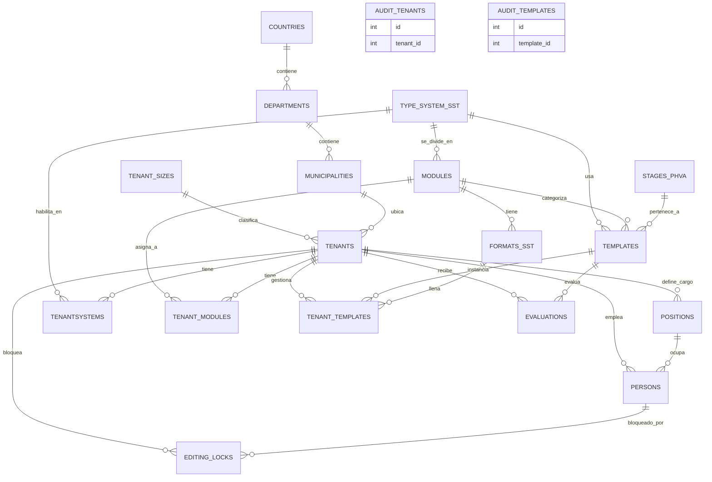

# Modelo Físico Entidad-Relación (SG-SST)

Este diagrama se genera dinámicamente con código utilizando **Mermaid**. Es ideal para documentar tu proyecto ya que nunca pierde calidad, no pesa nada y es 100% texto puro.

Puedes previsualizarlo en VS Code presionando `Ctrl + Shift + V` (o instalando la extensión **Mermaid Preview** si tu VS Code no la renderiza nativamente), o bien subiendo este archivo a GitHub donde se dibujará mágicamente.

